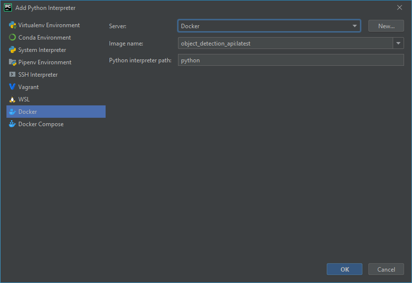

# diploma-thesis
Repozitorij za diplomsko delo na visokošolskem strokovnem študiju Računalništvo in informatika

Naslov: Uporaba globokega učenja za prepoznavanje objektov na fotografijah turističnih ponudnikov  
Avtor: Gregor Novak  
Mentor: doc. dr. Tomaž Curk  
Univerza v Ljubljani  
Fakulteta za Računalništvo in informatiko

## POSTAVITEV OKOLJA
Celoten projekt se razvija v programskem jeziku Python. Za razvoj in poganjanje kode se trenutno uporablja okolje PyCharm, za interpreter projekta znotraj PyCharma pa prilagojena Docker slika, da je ob namestitvi vseh potrebnih gradnikov možnost potencialnih zapletov čim manjša.

### Generiranje Docker slike
Docker slika, ki jo uporabljamo v okviru projekta, se lahko zgradi s priloženo datoteko Dockerfile, pred tem pa se moramo seveda prepričati, da je na našem računalniku Docker uspešno nameščen.  
Odpremo terminal in se prepričamo, da je trenutni delovni direktorij nastavljen na domač direktorij repozitorija, ki vsebuje priloženo datoteko Dockerfile.  
Da ustvarimo novo Docker sliko, v tem direktoriju poženemo naslednji ukaz:

```
docker build -t moj-tag .
```

kjer **moj-tag** predstavlja željeno ime nove Docker slike.

### Nastavitev interpreterja v integriranem razvojnem okolju PyCharm
Naslednja navodila so bila uporabljena na operacijskem sistemu Windows in so povzeta po uradnih navodilih, dostopnih na naslednji povezavi:  
https://www.jetbrains.com/help/pycharm/using-docker-as-a-remote-interpreter.html

#### Prednastavitve
Prepričamo se, da imamo v PyCharmu aktiviran vtičnik za Docker. Vtičnik je ob namestitvi okolja PyCharm aktiviran samodejno, če pa smo ga ročno onemogočili, lahko to spremenimo na strani **Plugins** pod nastavitvami programa.  
Če uporabljamo operacijski sistem Windows, moramo v programu **Docker Desktop** pod **Settings/General** obkljukati možnost **Expose daemon on tcp://localhost:2375 without TLS**.


#### Nastavitev Dockerja kot oddaljeni interpreter
V PyCharmu odpremo nastavitve za interpreter projekta, **Settings/Project:<ime-projekta>/Project Interpreter** in desno od polja za ime interpreterja kliknemo na ikono z zobnikom in izberemo **Add...**, da lahko dodamo nov interpreter.  
V novem pojavnem oknu na levi strani na seznamu izberemo možnost **Docker** in v spustnem meniju pod možnostjo **Server:** izberemo Docker strežnik. Če srežnik ne obstaja, izberemo **New...** in ustvarimo nov strežnik z naslednjimi nastavitvami:

  

Ko imamo izbran strežnik, pod možnostjo **Image name:** izberemo ime slike, ki smo jo v prvem koraku zgradili s pomočjo priležene datoteke Dockerfile. V spodnjem primeru se slika imenuje **object_detection_api**.

  

Izbiro potrdimo s klikom na gumb **OK**, kar naredi nov interpreter. Izbira interpreterja za projekt bi sedaj morala izgledati tako, kot na spodnji sliki:

  

Kliknemo na gumb **OK** in s tem tudi zaključimo nastavitev Python interpreterja za naš projekt.

PyCharm bo sedaj datoteke poganjal znotraj "containerja" s sliko, ki smo jo izbrali za interpreter. Ob tem bo celoten direktorij projekta znotraj "containerja" avtomatsko montiran na mestu **/opt/project/**, kar pomeni, da se bodo vse generirane datoteke samodejno shranile tudi v lokalnem direktoriju na disku.